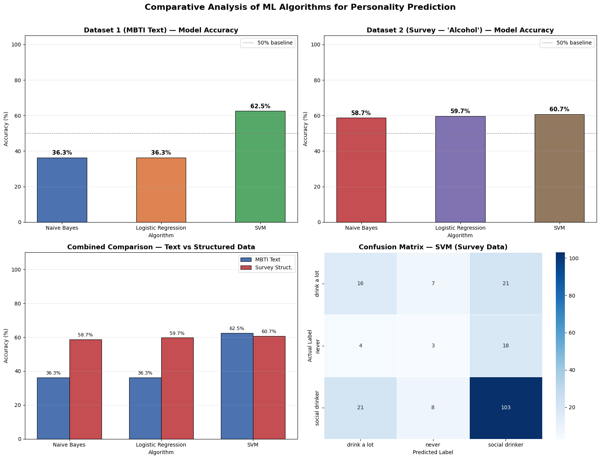
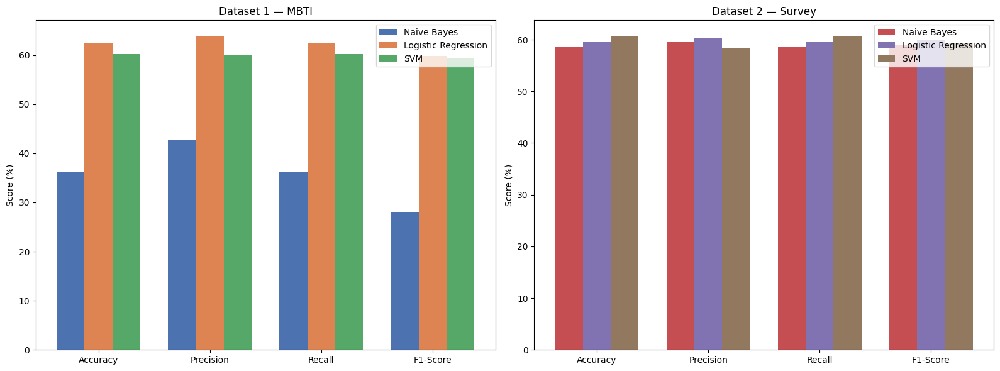

# Comparative Analysis of Machine Learning Algorithms for Personality Prediction

A machine learning project comparing **Naive Bayes**, **Logistic Regression**, and **SVM (LinearSVC)** across two very different types of data:

1. **Text data** — predicting MBTI personality type from social media posts
2. **Structured data** — predicting a behavioral trait from a Young People survey dataset

This was completed as a university mini-project for an Introduction to Intelligent Systems course.

## Overview

The goal of this project is to see how the same three classification algorithms perform when applied to fundamentally different kinds of input: unstructured text vs. structured tabular data.

**Dataset 1 — MBTI Personality (Text)**
- Raw social media posts are cleaned (lowercased, URLs stripped, special characters removed)
- Text is vectorized using **TF-IDF** (max 5,000 features)
- Target: 16 MBTI personality types

**Dataset 2 — Young People Survey (Structured)**
- Numeric survey responses are used as features
- Missing values handled, features scaled with `StandardScaler`
- Target: Alcohol consumption category

Both datasets are split 80/20 (train/test) with stratified sampling, and each of the three models is trained and evaluated on both.

## Models Compared

| Model | Dataset 1 (Text) | Dataset 2 (Structured) |
|---|---|---|
| Naive Bayes | Multinomial NB | Gaussian NB |
| Logistic Regression | ✅ | ✅ |
| SVM (LinearSVC) | ✅ | ✅ |

Each model is scored on **Accuracy, Precision, Recall, and F1-Score**.

## Repository Structure

```
.
├── IIS_Mini_Project_3(final).ipynb    # Main notebook: preprocessing, training, evaluation, visualizations
├── IIS_Project_Report.pdf             # Full project report
├── datasets/
│   └── survey_dataset/                # Young People Survey dataset
├── images/
│   ├── personality_prediction_results_1.png   # Model comparison charts + confusion matrix
│   └── detailed_metrics_chart.png              # Accuracy/Precision/Recall/F1 breakdown
├── requirements.txt
├── .gitignore
└── README.md
```

## Datasets

- **[MBTI Personality Dataset](https://www.kaggle.com/datasets/datasnaek/mbti-type)** — social media posts labeled by MBTI type (16 classes). *Not included in this repo due to file size — download it from the Kaggle link above and place it in `datasets/mbti_dataset/`.*
- **[Young People Survey Dataset](https://www.kaggle.com/datasets/miroslavsabo/young-people-survey)** — survey responses from young people; the "Alcohol" column was used as the target (drink a lot / social drinker / never). Included in this repo under `datasets/survey_dataset/`.

## How to Run

This notebook was originally built and run in **Google Colab**.

1. Open `IIS_Mini_Project_3(final).ipynb` in [Google Colab](https://colab.research.google.com/) or Jupyter
2. If using Colab, mount your Google Drive and update the dataset paths:
   ```python
   MBTI_PATH   = "/content/drive/MyDrive/.../mbti_1.csv"
   SURVEY_PATH = "/content/drive/MyDrive/.../responses.csv"
   ```
   If running locally instead, point these paths to `datasets/mbti_dataset/` and `datasets/survey_dataset/` and remove the `drive.mount()` cell.
3. Install dependencies:
   ```bash
   pip install -r requirements.txt
   ```
4. Run all cells in order.

## Results

**Dataset 1 — MBTI Text**

| Model | Accuracy | Precision | Recall | F1-Score |
|---|---|---|---|---|
| Naive Bayes | 36.31 | 42.63 | 36.31 | 28.10 |
| Logistic Regression | **62.54** | 63.88 | 62.54 | 59.82 |
| SVM | 60.17 | 60.08 | 60.17 | 59.38 |

**Dataset 2 — Survey (Alcohol)**

| Model | Accuracy | Precision | Recall | F1-Score |
|---|---|---|---|---|
| Naive Bayes | 58.71 | 59.56 | 58.71 | 59.09 |
| Logistic Regression | 59.70 | 60.34 | 59.70 | 60.00 |
| SVM | **60.70** | 58.25 | 60.70 | 59.35 |

**Logistic Regression performed best on the text dataset** (62.54% accuracy) — it handles high-dimensional sparse TF-IDF features well without assuming feature independence. **SVM performed best on the structured survey dataset** (60.70% accuracy), benefiting from clearly defined numeric features and feature scaling. Naive Bayes underperformed on text data due to its independence assumption not holding for natural language.





For the full write-up (methodology, discussion, limitations, future work), see [`IIS_Project_Report.pdf`](IIS_Project_Report.pdf).

## Tech Stack

- Python
- pandas, NumPy
- scikit-learn
- matplotlib, seaborn

## Author

Parthvi Rathod

## License

This project was created for academic purposes as part of a university course assignment.

